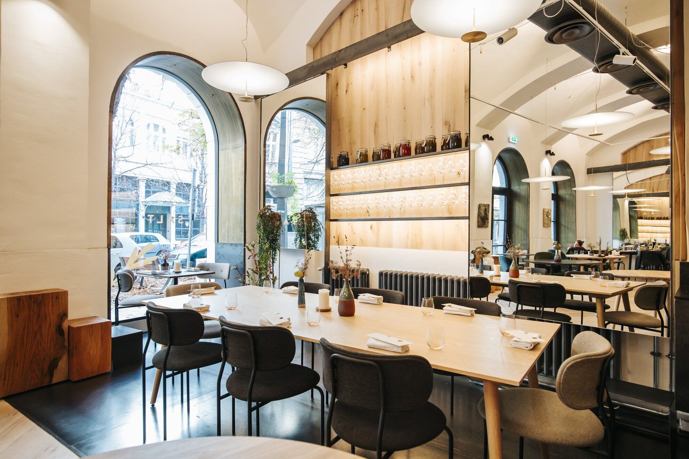
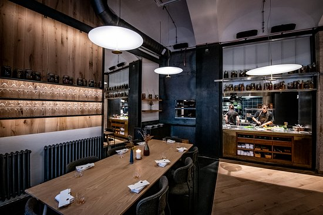
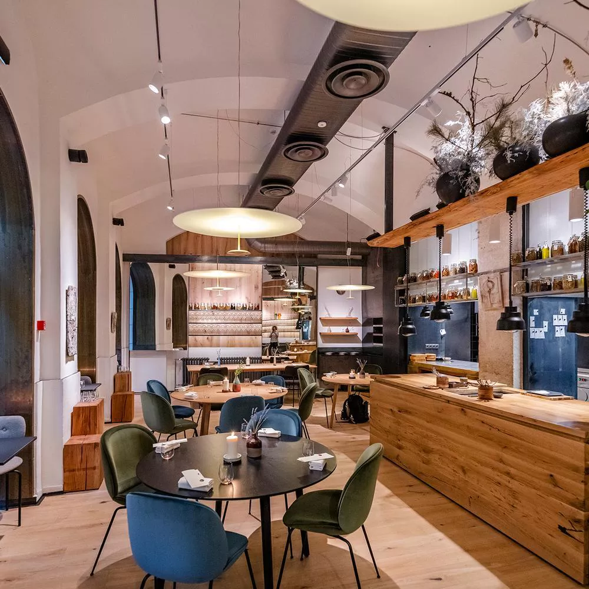
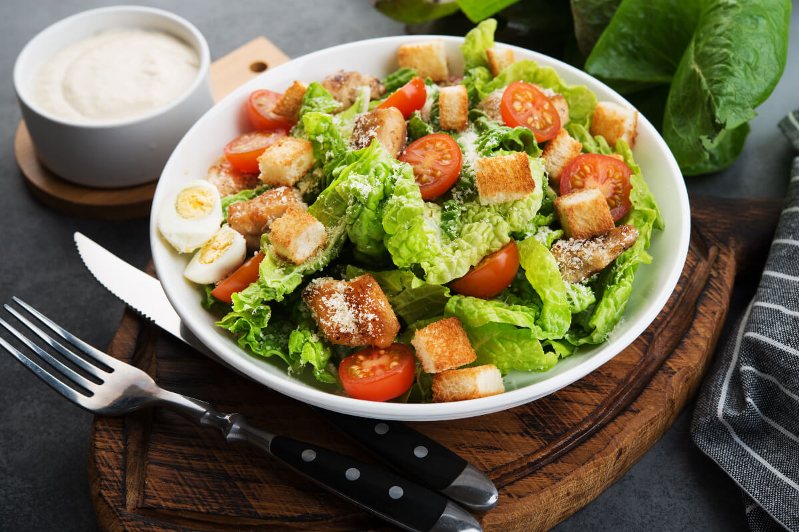
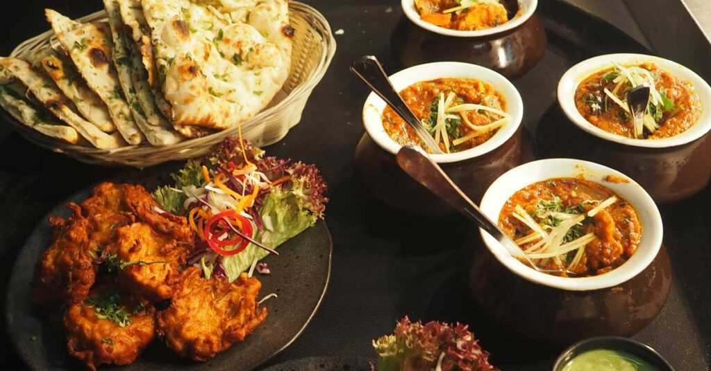

<!-- Header az összes oldalon -->
#Imaginary

[Föoldal](#index.html) | [Étlap](#etlap.html) | [Itallap](#itallap.html) | [Asztalfoglalás](#asztalfoglalas.html)|
[Dark mode ikon (hold vagy nap)](#darkmode)

<!-- Főoldal -->
<!-- 1 szekió -->

<!-- a szöveg a kép közepén jelenik meg -->
# Üdvözlünk éttermünk Weboldalán
Kóstolja meg kulináris remekeinket és élvezze vendégszeretetünket! Várjuk szeretettel éttermünkben!

<button>Asztalfoglalás</button>

## Galeria
### Éttermünk belülröl
<!-- Galéria Képei -->

Az étterem belső tere csillogó kandeláberekkel és lágy fényekkel várja vendégeit, amelyek kellemes és meghitt légkört teremtenek.

Az étterem néhány asztalánál impozáns kilátás és tágas panorámaablakok nyújtanak lehetőséget, hogy a vendégek élvezhessék a város vagy a táj szépségét, miközben ízlelik az ételeket és élvezik a társaságot.

A modern és stílusos bútorok és dekorációk harmonikusan egyesülnek az étterem belső terében, létrehozva egy elegáns és kifinomult atmoszférát.

Az étterem belső terében elhelyezett intim asztalok és luxus kényelem ötvözete tökéletes helyszínt teremt egy romantikus vacsorához vagy egy exkluzív üzleti találkozóhoz.

Friss kevert saláta ágyon fekszik, gazdagon megszórva szezámmaggal és pirított tökmaggal. A tetején kifőzött tojás szeletekkel és friss, ízletes paradicsomkarikákkal. A salátát finom olívabogyók és házi készítésű balzsamecet öntet teszi tökéletessé.

Száraz vöröslencsés pita különleges, rántott húshoz hasonlító töltelékkel, amelyet körít a ropogós zöldségekkel és a fűszeres jalapeno mártással. Az ételt friss zöldfűszerekkel és pirított szezámmaggal szolgáljuk, hogy az ízek teljesen kibontakozzanak.

Szárazra sütött karajszeletek, melyeket ropogósra sütünk és friss salátával tálalunk. Az étel tökéletesen kiegészül a pikáns foghagymás-kapros öntettel, mely fokozza a hús ízét és frissességét. A különleges összeállítás friss zöldségekkel és zöldfűszerekkel garantáltan egy ízletes és egészséges ételélményt kínál.

Egy gazdag, laktató bableves, melyet füstölt hússal és friss zöldségekkel főzünk. A krémes és ízletes leves tökéletes egyensúlyt teremt a szaftos hús és a friss zöldségek között, miközben a füstölt ízjegyek mélyítik az ízélményt.

<!-- Galária Képei vége -->

### Tekinst meg éttermunk Kedvcsináló Videoját

<video controls>
<source src="./imgs/fooldal/Ultimate Cheese Lasagna - The perfect blend of five cheeses!.mp4" type="video/mp4">
</video>

<!-- Étlap Tartalma - 2.oldal -->

# Étlap 

<!-- A képek az árlista mellett helyezkednek el a terven látszik-->
### Elöételek

Gyümölcsleves
Friss szezonális gyümölcsökből készült hideg leves.
Ár: 890 Ft

Gombás krémleves
Sűrű gombakrémleves pirított kenyérrel.
Ár: 790 Ft

Caprese saláta
Friss mozzarella sajt paradicsommal, bazsalikommal és balzsamecettel.
Ár: 990 Ft

### Főételek

Sült csirkecomb
Sült csirkecomb párolt zöldségekkel és petrezselymes burgonyával.
Ár: 1990 Ft

Sült lazac filé
Szezámmagos sült lazac filé zöldséges rizzsel és korianderes joghurt mártással.
Ár: 2290 Ft

Vegetáriánus pite
Friss zöldségekkel töltött vegetáriánus pite salátával.
Ár: 1890 Ft

### Desszertek

Csokoládétorta
Gazdag csokoládétorta vaníliafagyival és málnaszósszal.
Ár: 690 Ft

Almás pite
Sütőtökös sütemény vaníliafagyival és karamellmázzal.
Ár: 590 Ft

Málna panna cotta
Málna ízű panna cotta friss mentalevelekkel.
Ár: 790 Ft

##   Szervízdíj táblázat
<table>
      <thead>
       <tr>
      <th>Szervízdij összeghatár</th>
                <th>10000-ft felett</th>
                <th>20000-ft felett</th>
                <th>30000-ft felett</th>
              </tr>
            </thead>
            <tbody>
              <tr>
                <td>Szervízdij %os aránya</td>
                <td>5%</td>
                <td>7%</td>
                <td>10%</td>
              </tr>
            </tbody>
</table>

<!-- Itallap Tartalma - 3.oldal -->
<!--Itallap felirat és a Kép egymás mellet helyezkednek el-->
# Itallap

### Üditők

Coca-Cola
0,33 literes dobozban.
Ár: 350 Ft

Fanta
0,33 literes dobozban.
Ár: 350 Ft

Sprite
0,33 literes dobozban.
Ár: 350 Ft

### Dobozos Üdítők

Coca-Cola Zero
0,33 literes dobozban.
Ár: 350 Ft

Fanta Zero
0,33 literes dobozban.
Ár: 350 Ft

Sprite Zero
0,33 literes dobozban.
Ár: 350 Ft

### Gyümölcslevek

Narancslé
Frissen facsart narancslé.
Ár: 490 Ft

Almalé
Frissen facsart almából készült.
Ár: 490 Ft

Ananászlé
Frissen facsart ananászlé.
Ár: 490 Ft

### Limonádék

Citromos Limonádé
Frissen facsart citrommal készült.
Ár: 450 Ft

Málnás Limonádé
Friss málnával készült.
Ár: 490 Ft

Uborkás Limonádé
Friss uborkával és mentával készült.
Ár: 550 Ft

### Csapolt sörök

Soproni Világos
0,5 literes pohárban.
Ár: 590 Ft

Borsodi Bivaly
0,5 literes pohárban.
Ár: 620 Ft

Heineken
0,5 literes pohárban.
Ár: 690 Ft

### Fehér Borok 

Chardonnay
Francia Chardonnay.
Ár: 1490 Ft/pohár

Sauvignon Blanc
Spanyol Sauvignon Blanc.
Ár: 1390 Ft/pohár

Pinot Grigio
Olasz Pinot Grigio.
Ár: 1290 Ft/pohár

### Vörös Borok

Merlot
Chilei Merlot.
Ár: 1590 Ft/pohár

Cabernet Sauvignon
Argentín Cabernet Sauvignon.
Ár: 1690 Ft/pohár

Shiraz
Ausztrál Shiraz.
Ár: 1790 Ft/pohár

### Kávé
Espresso
Erős, fekete kávé.
Ár: 390 Ft

Cappuccino
Espresso kávé tejjel és tejhabbal.
Ár: 490 Ft

### Koktélok
Mojito
Friss menta, fehér rum, cukor, szódavíz és lime.
Ár: 890 Ft

Piña Colada
Kókuszkrém, fehér rum és ananászlé.
Ár: 990 Ft

Margarita
Tequila, triple sec és lime juice.
Ár: 850 Ft

### Rövid italok

Whiskey
Jack Daniels.
Ár: 890 Ft

Vodka
Absolut.
Ár: 790 Ft

Rum
Havana Club.
Ár: 690 Ft

<!--Azztalgoflalás tartalma -->
# Asztalfoglalás

<label for="name">Név</label>
<input type="text" id="name" name="name" placeholder="Példa Péter" size="20" maxlength="50" required>
 
<label for="email">Email:</label>
<input type="email" id="email" name="email" placeholder="peldapeter@gmail.com" required>
 
<label for="quantity">Hány főre:</label>
<input type="number" id="quantity" name="quantity" min="1" max="30" value="1" required>
 
<label for="date">Dátum:</label>
<input type="date" id="date" name="date" required>
 
<input type="radio" id="accept" name="accept">
<label for="accept">Különleges igényem van</label>
<select name="kivalaszt">
    <option value="">Kiválaszt</option>
    <option value="Etetőszékre van szükségem">Etetőszékre van szükségem</option>
    <option value="Akadálymentes Asztal">Akadálymentes Asztal</option>
</select>
 
<label for="message">Üzenet:</label>
<textarea id="message" name="message" placeholder="Írja ide üzenetét"></textarea>

<input type="checkbox" id="acceptTerms" name="acceptTerms">
<label for="acceptTerms">Elfogadom a feltételeket</label>

<button type="submit">Foglalás Elküldése</button>

<button type="reset">Visszaállítás alap helyzetbe</button>

